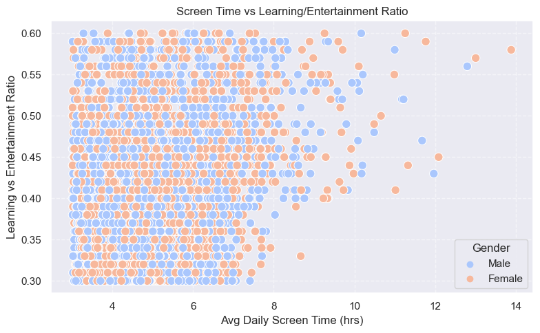

# 📱 Kids' Screen Time — Exploratory Data Analysis

This notebook explores how children’s screen time affects their physical and mental well-being using a real-world dataset. The analysis focuses on health impacts, usage trends, and behavioral patterns based on visualized data.

---

## 📦 Dataset Overview

The dataset includes:
- Age, gender, screen time duration
- Devices used (TV, phone, tablet, computer, etc.)
- Health impacts (e.g., eye strain, poor sleep, posture issues)
- Number of seasons watched (used as a proxy for binge-watching behavior)

> 🗂️ Dataset Source: [Kaggle – Kids' Screen Time Dataset](https://www.kaggle.com/datasets/ankushpanday2/indian-kids-screentime-2025)

---

## 📊 Libraries Used

- `pandas`, `numpy` – Data wrangling
- `matplotlib`, `seaborn` – Visualization
- `os`, `shutil` – File handling for Kaggle API

---

## 📈 Visual Analysis & Key Findings

### 1. Screen Time Category Distribution

TV and phone usage are the most dominant forms of screen exposure among kids.

---

### 2. Top 4 Health Impacts

Children commonly reported **eye strain**, **poor sleep**, and **headaches**. Less common concerns were grouped as "Other".

---

### 3. Gender-Based Usage Breakdown

There were subtle gender differences in screen preferences—boys leaned more towards gaming, while girls leaned towards mobile viewing.

---

### 4. Correlation Between Age, Screen Time, and Learning Ratio

A correlation heatmap showing that:

    Older kids tend to have more educational screen use

    Higher screen time often correlates with lower learning content

Strong co-occurrence was found between poor sleep, eye strain, and mood issues—suggesting cascading effects of screen overuse.

---

### 5. Screen Time vs Learning/Entertainment Ratio

A scatter plot showing how increased screen time is generally associated with a lower learning-to-entertainment ratio, with gender differences in usage patterns.

---

## 💡 Insights

- Kids with **more than 4 hours/day** of screen time reported the highest number of issues.
- **TV and phone** are the most dominant devices; gaming and mobile viewing show gender-based differences.
- There's a **negative correlation between screen time and learning-focused content**—suggesting higher screen exposure often leans toward entertainment.
- **Older kids** tend to have a slightly **higher learning ratio**, possibly due to more academic responsibilities.
- Health impacts often **co-occur**, indicating that screen overuse can trigger a chain of physical and mental effects.

---

## 🚀 Future Enhancements

- Add time-series trends if longitudinal data becomes available  
- Build a classifier to predict risk of poor sleep from usage type  
- Create dashboards with Plotly or Streamlit

---

## 🤝 Contribution

This project is part of my personal portfolio to demonstrate real-world data skills.  
Feel free to fork, star, raise issues, or contribute!

> 📝 Feedback and critiques are welcome — I'm always learning and improving.

---

## 🔖 License

This project is licensed under the MIT License.
